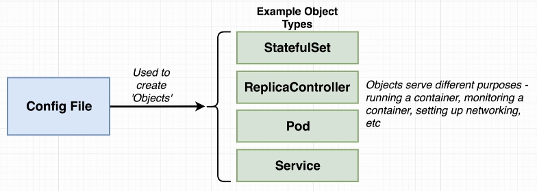

# Intro
  

  

  
  
  

  


# Goal: run the [**multi-container app**](./https://github.com/AndLydakis/FibCalc) in K8s

   


    
   

# Object Types  


  
  


# Pods  
  
* For grouping containers that are required to be deployed together/have similar purpose  

    

**Good Example**


# Services  

  

### Node Port Service Config  

  

  

### Sample App

  

# Api Versions  

   
 
### Feed config to kubectl
 ```bash
kubectl apply -f <path to file>
 ```

### Get status of object
 ```bash
kubectl get <type of objects <pods, services>>
 ```

### Get IP of cluster
 ```bash
minikube ip
 ```